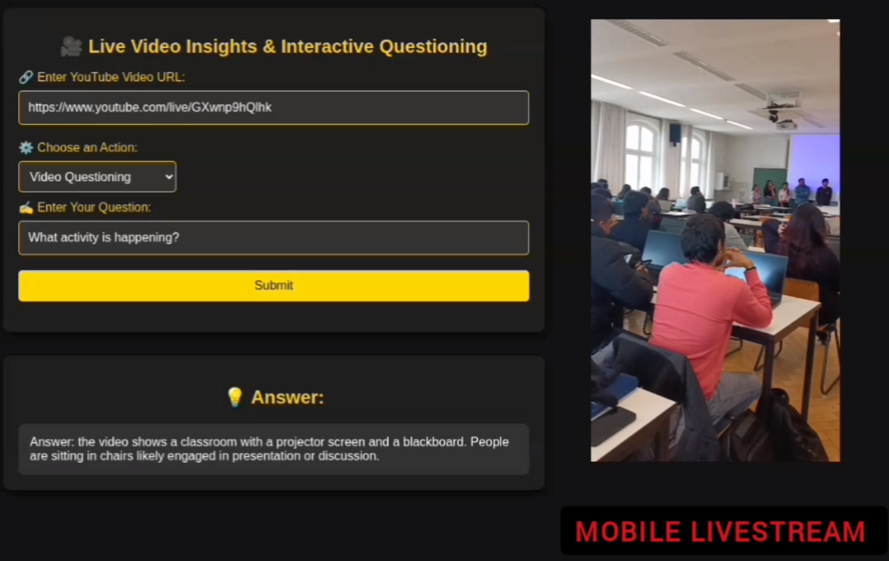

# Real-Time Scene Understanding with Live Visual Q&A

## Challenge
As part of a course challenge, we were tasked to build a real-time scene understanding framework — the goal: enable intelligent systems to understand, track, and respond to what’s happening live in a video.

## What I Built

🎥 I developed a real-time processing pipeline that:

- Extracts frames from YouTube live streams directly from my phone  
- Feeds them into a Vision-Language Model (VLM) to enable dynamic Q&A on the current scene

[](https://www.youtube.com/watch?v=-NArheKAGSo)


💡 At the core is **LLaVA** (Large Language and Vision Assistant) — a multimodal AI model that understands both images and text. It analyzes live video frames and answers natural language questions. LLaVA bridges computer vision and NLP, making it ideal for live monitoring use cases.

 ## How to Run the Project
 
 Create and activate a virtual environment, then install the dependencies:
 
 ```bash
 python -m venv venv
 source venv/bin/activate   # On Windows: venv\Scripts\activate
 pip install -r requirements.txt
 ```
 
 Run the Flask app with:
 
 ```bash
 python app.py
 ```


This will start the server and show a local host URL (e.g., `http://127.0.0.1:5000`). Open this URL in your browser to access the app.

**To use the app:**  
1. Start a YouTube live stream from your mobile phone  
   - *Note:* Requires ≥50 YouTube subscribers  
   - *Critical setting:* Select **"Made for Kids: Yes"** in stream settings  

2. Copy the live stream URL and paste it into the app's input field  
3. Enter questions about the live scene to get real-time AI answers  

## Demo Video Scene Analysis

In the attached demo video, I tested the app on real YouTube live streams showing different scenes:

- ✅ **Indoor environment:** Detected a classroom with students engaged in discussion; projector and seating layout.
- ✅ **Residential environment:** Inferred possible activities like cooking, dishwashing, or general use based on context.
- ✅ **Outdoor Public Space:** Analyzed garden area with buildings and paths; found no hazards or human/animal presence, confirming safety.
- ✅ **Personal Workspace:** Described the subject’s appearance, posture, and room layout, including walls and doors.


## Contributions 🤝

Feel free to open issues or submit pull requests if you want to contribute. This is an open-source project, and we welcome feedback!
